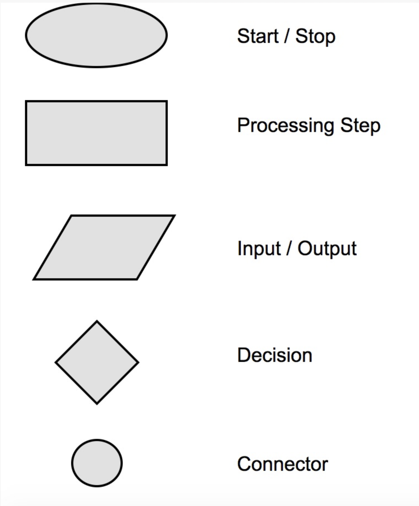
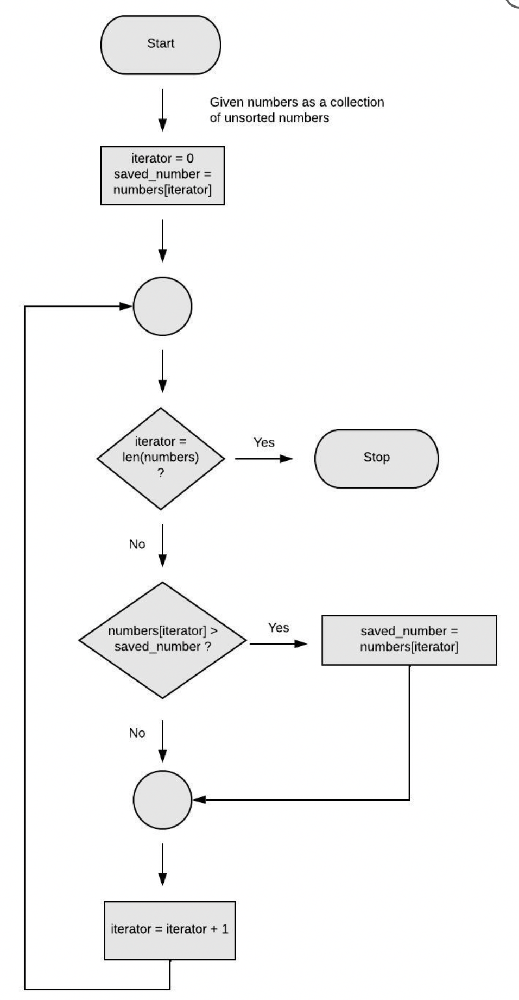
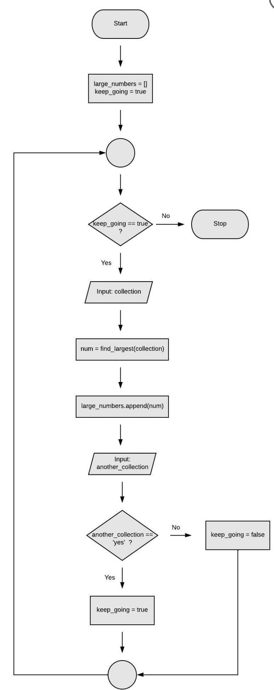
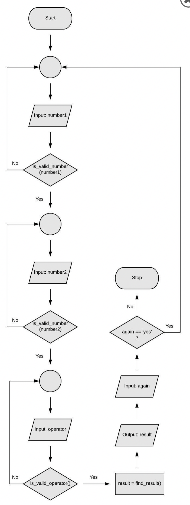

Notes for Lesson 2 for PY101 course.
- Flowcharts
  
# Contents
- [Contents](#contents)
- [Flowchart Components](#flowchart-components)
  - [Larger Problem](#larger-problem)
  - [Pseudocode Declarative syntax for a Calculator](#pseudocode-declarative-syntax-for-a-calculator)
  - [Flowcharting the Calculator](#flowcharting-the-calculator)


# Flowchart Components

Using a flowchart helps map out the logical squence of a possible solution in a visible way.
- 

**EXAMPLE:** flowchart for approach to finding the largest number in a collection.
- 

**Notes:**
    - Decision max 2 branches. 3+ use separate
    - arrows show flow to specify iteration logic. Called the imperative or procedural way to solve a problem
    - map and filter are rarely used (considered un-pythonic), pythonistas prefer to use comprehensions
    - when using flowchart we will be imperative. Visually show loop manually iinstead of usiing specific built in contstruct
    - reasons - forces thinking like a computer which helps debug logical errors.

## Larger Problem

Mapping out solution to part of a complex problem.

Let's suppose that we need to ask the user to enter N collections of numbers and that we want to find and display the largest number from each collection. How would we approach coming up with a solution here?
```
- - Simpler Pseudocode
while the user wants to keep going
ask the user for a collection of numbers
extract the largest one from that collection and save it
ask the user if they want to input another collection
return the saved list of numbers
```

When pseudocode gets long, it's difficult to trust the accuracy of the logic (remember, you can only verify the logic by running it). 

Extract a logical grouping into a sub-process and tackle the various pieces separately.


- Translated to formal pseudocode
```
- - Formal Pseudocode
START

SET large_numbers = []
SET keep_going = True

WHILE keep_going == True
    GET "enter a collection"
    SET collection
    SET largest_number = SUBPROCESS "extract the largest one from that collection"
    large_numbers.append(largest_number)
    GET "enter another collection?"
    IF "yes"
      keep_going = True
    ELSE
      keep_going = False

PRINT large_numbers
```
`SUBPROCESS` is to show some other thing will extract the largest number from the collection. 

- Translated to a flowchart
- 

**Notes:**
- `num = find_largest(collection)` is our `sub-process`. 
- this is high level view of first flowchart
- when move logic to subprocess, we use declarative type of syntax(instead of imperative)
    - example: `validate_input` in a square as `SUB-PROCESS` that returns `True` or `False`
      - When ready to focus on this subprocess, we focus on this, not the rest of code.

## Pseudocode Declarative syntax for a Calculator

```
- - Pseudocode, Declarative syntax
Get the first number
    Make sure it's valid, otherwise, ask for another
Get the second number
    Make sure it's valid, otherwise, ask for another
Get the operator
    Make sure it's valid, otherwise, ask again
Perform the operation on the two numbers

Display result

Ask whether the user wants to do another calculation
```
Above doesn't outline how to validate. 

No specifics or imperative yet.

###Interview Coding Assesement will expect to lay out logic before beginning to code

## Flowcharting the Calculator
- 

**Notes:**
- Flowchart made with 3 `SUB-PROCESS` - `is_valid_number`, `is_valid_operator`, and `find_result`
- Not worrying about the low-level details (of how those sub-processes will work), we can think at a higher level about our overall application logic. 
- When we're ready to dive into how each of those sub-processes should work: 
  - We can create the detailed pseudocode and flowcharts for each of them.
